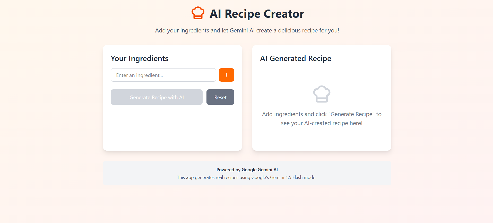

<!-- Banner or Logo -->
<p align="center">
  
</p>

<h1 align="center"> AI Recipe Creator</h1>
<p align="center">
  Create your own recipes with the help of AI.
  <br>

---

## 📌 About
Recipe Creator App is an AI-powered web tool that generates recipe ideas instantly based on the ingredients you provide, using the Google Gemini API for intelligent suggestions.

---

## 🚀 Live Demo
🔗 **[recipe-creator-app.vercel.app](https://recipe-creator-app.vercel.app/)**  

---

## ✨ Features
- 🥗 **AI-Powered Suggestions** – Get recipes instantly using the Gemini API.  
- 🛠 **Ingredient-Based Search** – Just type in what you have.  
- 📱 **Responsive Design** – Works on desktop, tablet, and mobile.  
- 🎨 **Modern UI** – Built with React + Tailwind CSS.

---

## 🛠️ Tech Stack
&nbsp; &nbsp;&nbsp; &nbsp;&nbsp; &nbsp;
---

## 📦 Installation
1. **Clone the repository**
    ```bash
    git clone https://github.com/Nishit-Khatri/Recipe-Creator-App.git

    ```
2. **Install dependencies**
    ```bash
    npm install
    ```
3. **Run the development server**
    ```bash
    npm run dev
    ```

---

## 📸 Screenshots
 Home Page



 Recipe Suggestions  


 
---